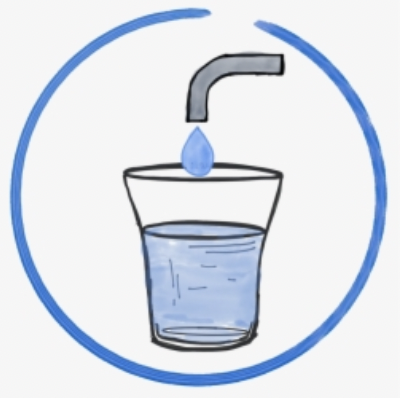

<!-- PROJECT LOGO -->
 

  

  <h3 align="center">Well Well : AI to find best well location</h3>

  

    Machine Learning project to help communities find the best water well location and get access to clean water 
     
    <a href="https://www.youtube.com/watch?v=CnvxaTBWoZo"><stron>Watch the video »</strong></a>
     
     
    <a href="https://wellwellwell.h4k00r.com/#">View Demo</a>
    ·
    <a href="https://github.com/IAbeteEtMechante/Well_well/issues">Report Bug</a>
    ·
    <a href="https://github.com/IAbeteEtMechante/Well_well/issues">Request Feature</a>
  

 
 

This is a project submission for the 2021 IBM **Call for Code Challenge**. 

The 2021 IBM Call for Code Challenge is a global contest to fight Climate Change, which focuses on 3 domains, one of them being access to clean water. 
8oo million people in the world dont have access to clean water today. Some communities try to drill water wells, but they need help to know the best potential location, before they start drilling. Why not use a little bit of AI to help them out?

Watch this [short video](https://www.youtube.com/watch?v=CnvxaTBWoZo) to have a better idea of what we are all about.

Author: Pierre Schwob
 

<!-- TABLE OF CONTENTS -->
## Table of Contents

* [About the Project](#about-the-project)
  * [Built With](#built-with)
* [Machine Learning module](#machine-learning-module)
* [Physical Device](#physical-device)
* [Contributing](#contributing)
* [License](#license)
* [Contact](#contact)
* [Acknowledgements](#acknowledgements)

<!-- ABOUT THE PROJECT -->
## About The Project

What if, Machine Learning could help people find the best water wells location in a more systematic and inexpensive way. Meet Well well, our project using machine learning and robotics expertise to propose a 2 part solution to this problem:
<li>the first module, is a free web application that takes a single input,  the GPS location of any point in the world. Using a combination of geological features map, satellite imagery and Machine Learning, this web application will then predict the best places to drill a water well within walking distance. It can be used on any mobile phone anywhere in the world. </li>
<li>And we also thought about the countless people who don't have access to clean water and also do not have access to a mobile phone or even to the internet, that's why we also added a second module to our project, which is a cheap portable device, costing only under 10 USD. This device will store some precomputed ideal locations for wells all around the world. It will be able to detect the current the GPS location of any user,  and guide him or her to the nearest ideal place to drill a water well.</li>
 

The scientific literature is full of examples on how machine learning can help predict Groundwater mapping potential, using information available on maps like the distance to nearest river, the vegetation nearby, the soil composition etc....If like us you think it is time to bring those amazing ideas to life with a cheap and practical solution, answer the call and join us because for people in developing countries, access to clean water can change everything.

Plan of work:
*
*
*

### Built With
Here are the major frameworks that we built our project with.
* [IBM data Pak](https://www.ibm.com/products/cloud-pak-for-data)
* [ESRI](https://www.esri.com/en-us/home)

<!-- MACHINE LEARNING MODULE -->
## Machine Learning Module

<!-- PHYSICAL DEVICE -->
## Physical Device

<!-- CONTRIBUTING -->
## Contributing

If you are interested in this topic, you too can contribute to this work. Contributions are what will make the project better. Any contributions you make are **greatly appreciated**.

1. Fork the Project
2. Create your Feature Branch (`git checkout -b feature/AmazingFeature`)
3. Commit your Changes (`git commit -m 'Add some AmazingFeature'`)
4. Push to the Branch (`git push origin feature/AmazingFeature`)
5. Open a Pull Request

<!-- LICENSE -->
## License

All this work is fully openSource feel free to use it.

<!-- CONTACT -->
## Contact

Feel free to contact us on this repo, we are happy to hear from you.

Project Link: [https://github.com/IAbeteEtMechante/Well_well](https://github.com/IAbeteEtMechante/Well_well)

<!-- ACKNOWLEDGEMENTS -->
## Acknowledgements

If you want to learn more on this subject:

<!-- MARKDOWN LINKS & IMAGES -->
<!-- https://www.markdownguide.org/basic-syntax/#reference-style-links -->

